# Brain Tumor Classification

	
	
	
	

	<strong>EfficientNetB0-based four-class brain MRI classifier</strong> 
	Built for transparent experimentation, reproducible notebook workflows, and recruiter-friendly presentation.

---

## Table of Contents

- [1. Project Overview](#1-project-overview)
- [2. Research Motivation](#2-research-motivation)
- [3. Methodology](#3-methodology)
- [4. System Architecture](#4-system-architecture)
- [5. Dataset Analysis](#5-dataset-analysis)
- [6. Model Training](#6-model-training)
- [7. Experimental Results](#7-experimental-results)
- [8. Performance Metrics](#8-performance-metrics)
- [9. Explainability (Grad-CAM)](#9-explainability-grad-cam)
- [10. Limitations](#10-limitations)
- [11. Future Work](#11-future-work)
- [12. References](#12-references)

---

## 1. Project Overview

This repository contains a brain MRI classification workflow that detects four clinically important categories: glioma tumor, meningioma tumor, no tumor, and pituitary tumor. The goal is to support early screening and consistent image-based triage using deep learning, while keeping the implementation simple enough to inspect inside a single notebook.

Brain tumor classification matters because small imaging differences can represent large clinical differences. In practice, faster and more consistent screening can help radiologists prioritize suspicious cases, reduce manual workload, and support earlier intervention when tumors are present.

The core implementation lives in [main.ipynb](main.ipynb). It loads the images from the local dataset folders, resizes them to 150 x 150, trains an EfficientNetB0-based classifier, evaluates the model with a classification report and confusion matrix, and exposes a helper function for single-image prediction.

### At a Glance

| Item | Value |
| --- | --- |
| Task | Four-class brain MRI classification |
| Backbone | EfficientNetB0 |
| Input size | 150 x 150 RGB |
| Saved model | `effnet.h5` |
| Training epochs | 12 |
| Batch size | 32 |
| Optimizer | Adam |
| Loss | Categorical cross-entropy |

### Key Features

- Transfer learning with EfficientNetB0 for strong feature extraction and efficient scaling.
- Four-class MRI classification: glioma, meningioma, no tumor, and pituitary tumor.
- Notebook-first workflow for reproducibility and easy inspection.
- TensorBoard logging for training visibility.
- Model checkpointing to preserve the best validation result in `effnet.h5`.
- Learning-rate scheduling with `ReduceLROnPlateau`.
- Evaluation through accuracy, classification report, and confusion matrix.
- Lightweight inference helper for predicting one MRI image at a time.

---

## 2. Research Motivation

Why this problem is worth solving

Early brain tumor detection matters because treatment outcomes are strongly influenced by when a tumor is identified and how quickly care is escalated. MRI is one of the most informative modalities for brain imaging, but the interpretation burden is high and the cost of missing a suspicious lesion can be severe.

Radiologists work under real constraints: large case volumes, subtle inter-class differences, limited time, and variation in scan quality. Tumors such as glioma and meningioma can appear similar in certain slices, and non-tumor scans still require careful review to avoid false alarms.

Deep learning can assist diagnosis by learning discriminative spatial patterns directly from MRI data. A well-trained model does not replace the clinician; instead, it can act as a decision-support layer that highlights likely tumor categories, standardizes first-pass screening, and improves throughput in high-demand settings.

This project is useful in real healthcare contexts because it follows a practical workflow: folder-based image ingestion, transfer learning, quantitative evaluation, and a prediction helper. That makes it easier to prototype a clinical research workflow before moving to a regulated deployment pipeline.

---

## 3. Methodology

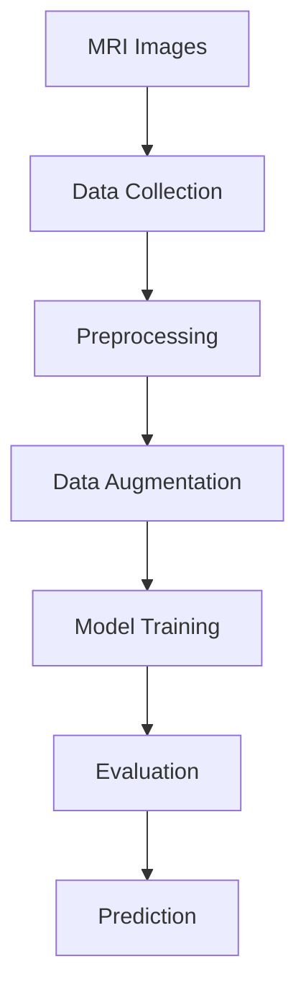

1. **MRI Images** - Raw MRI slices are organized into four class folders.
2. **Data Collection** - The notebook loads the images from `Training/` and `Testing/` into NumPy arrays.
3. **Preprocessing** - Every image is read with OpenCV, resized to 150 x 150, and one-hot encoded after label mapping.
4. **Data Augmentation** - The current notebook imports `ImageDataGenerator`, but it does not apply explicit augmentation transforms. This is a reasonable choice for a first pass because MRI anatomy should not be distorted without careful validation.
5. **Model Training** - EfficientNetB0 acts as the feature extractor, followed by global average pooling, dropout, and a 4-way softmax head.
6. **Evaluation** - Performance is measured on the held-out test split using a classification report and confusion matrix.
7. **Prediction** - The `img_pred()` helper predicts the class of a single MRI file path.

---

## 4. System Architecture

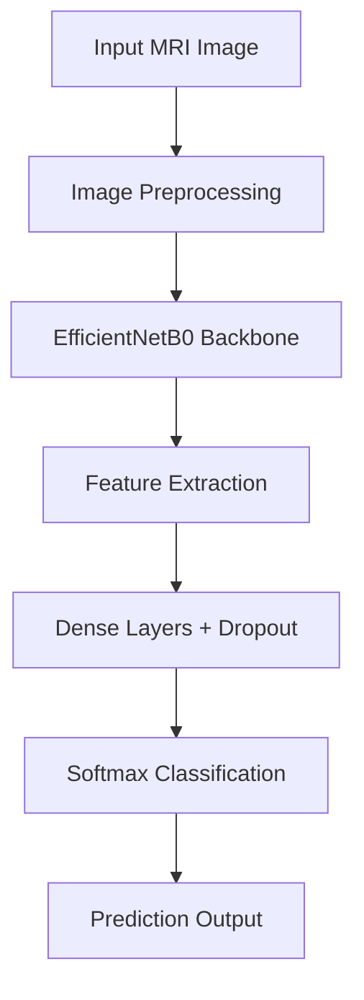

EfficientNetB0 was chosen instead of a traditional CNN because it provides a stronger accuracy/efficiency trade-off through compound scaling. That matters here because the dataset is moderate in size, and an over-parameterized custom CNN would be more likely to overfit. Transfer learning also lets the model reuse a representation learned from large-scale image data, which is especially helpful in medical imaging where labeled examples are valuable but limited.

The final model in [main.ipynb](main.ipynb) uses:

- `EfficientNetB0(weights='imagenet', include_top=False)`
- Global average pooling
- Dropout at 0.5
- Dense softmax layer with 4 outputs

---

## 5. Dataset Analysis

> **Source note:** The repository bundles the MRI data locally inside `Training/` and `Testing/`. The notebook does not cite a separate external dataset URL, so the local folders are the authoritative source used here.

The dataset contains four classes and is organized in class-specific directories. The notebook loads both folders, then creates a 90/10 train-test split for modeling.

### Dataset Statistics

| Statistic | Value |
| --- | --- |
| Dataset source | Repository-bundled MRI images in `Training/` and `Testing/` |
| Number of classes | 4 |
| Image size used by the model | 150 x 150 |
| Stored training images | 2,870 |
| Stored testing images | 394 |
| Total stored images | 3,264 |
| Modeling split in notebook | 90% train / 10% test |
| Class balance | Mildly imbalanced, with `no_tumor` underrepresented in the training folder |

### Class Distribution

| Class | Training | Testing | Total |
| --- | ---: | ---: | ---: |
| glioma_tumor | 826 | 100 | 926 |
| meningioma_tumor | 822 | 115 | 937 |
| no_tumor | 395 | 105 | 500 |
| pituitary_tumor | 827 | 74 | 901 |
| **Total** | **2,870** | **394** | **3,264** |

### Training Dataset Samples

<table>
	<tr>
		<td align="center"><strong>Glioma</strong> 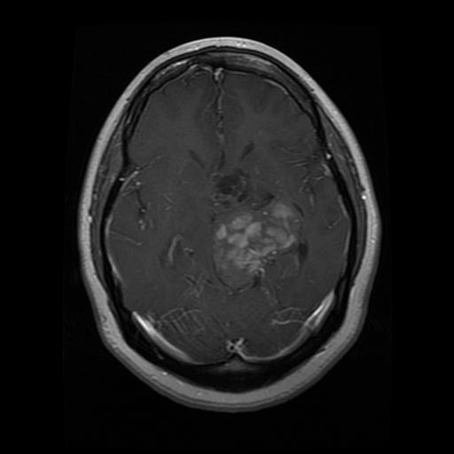</td>
		<td align="center"><strong>Meningioma</strong> 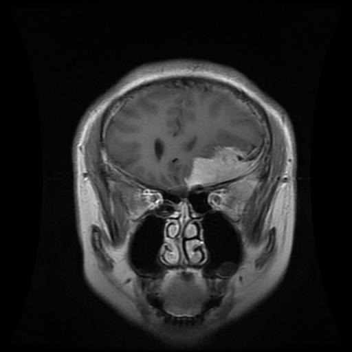</td>
		<td align="center"><strong>No Tumor</strong> 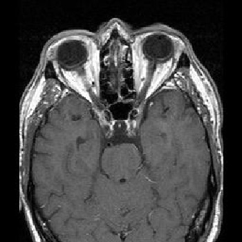</td>
		<td align="center"><strong>Pituitary</strong> 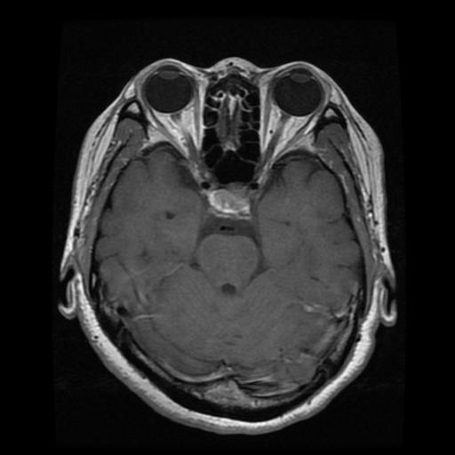</td>
	</tr>
</table>

### Testing Dataset Samples

<table>
	<tr>
		<td align="center"><strong>Glioma</strong> 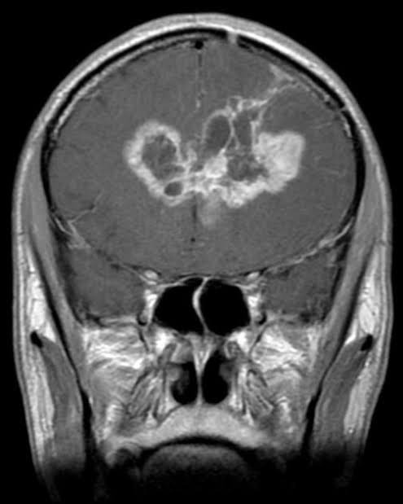</td>
		<td align="center"><strong>Meningioma</strong> 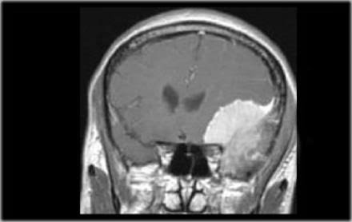</td>
		<td align="center"><strong>No Tumor</strong> 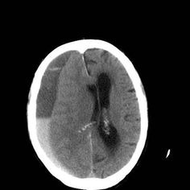</td>
		<td align="center"><strong>Pituitary</strong> 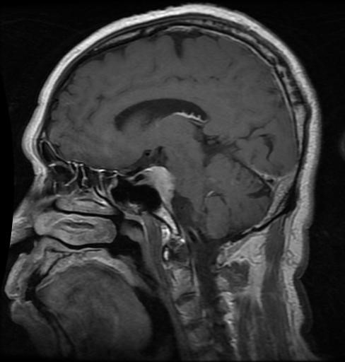</td>
	</tr>
</table>

---

## 6. Model Training

The notebook follows a transfer-learning training strategy rather than training a CNN from scratch. Images are normalized through resizing, labels are one-hot encoded, and the dataset is shuffled before the train/validation split. The current notebook does not use explicit augmentation transforms, which keeps the baseline simple and preserves anatomical structure.

### Hyperparameters and Training Settings

| Setting | Value | Why it matters |
| --- | --- | --- |
| Preprocessing | Resize to 150 x 150, OpenCV loading, label encoding | Ensures a fixed input shape for EfficientNetB0 |
| Data augmentation | Not enabled in the current run | Avoids unvalidated geometric distortion of MRI anatomy |
| Batch size | 32 | Balances memory use and gradient stability |
| Optimizer | Adam | Reliable default optimizer for transfer learning |
| Learning rate | Default Adam rate (`1e-3`) | Works well for a compact fine-tuning baseline |
| Epochs | 12 | Enough for convergence without excessive overfitting |
| Loss function | Categorical cross-entropy | Suitable for 4-class one-hot classification |
| Callback: TensorBoard | Enabled | Tracks training progress visually |
| Callback: ModelCheckpoint | Enabled (`effnet.h5`) | Saves the best validation model |
| Callback: ReduceLROnPlateau | Enabled | Lowers learning rate when validation stalls |
| Early stopping | Imported, but not enabled | Could be added if you want earlier convergence control |
| Final model params | 4,054,695 total | Compact enough for a transfer-learning baseline |

The notebook currently fine-tunes the model using the combined dataset, then evaluates on a held-out test subset created with `train_test_split(test_size=0.1, random_state=101)`.

---

## 7. Experimental Results

### Training Curves

<table>
	<tr>
		<td align="center"><strong>Accuracy</strong> 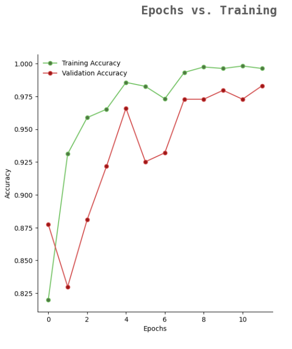</td>
		<td align="center"><strong>Loss</strong> 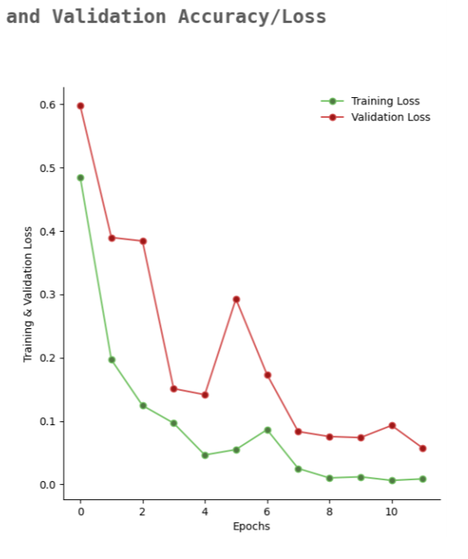</td>
	</tr>
</table>

### Confusion Matrix

	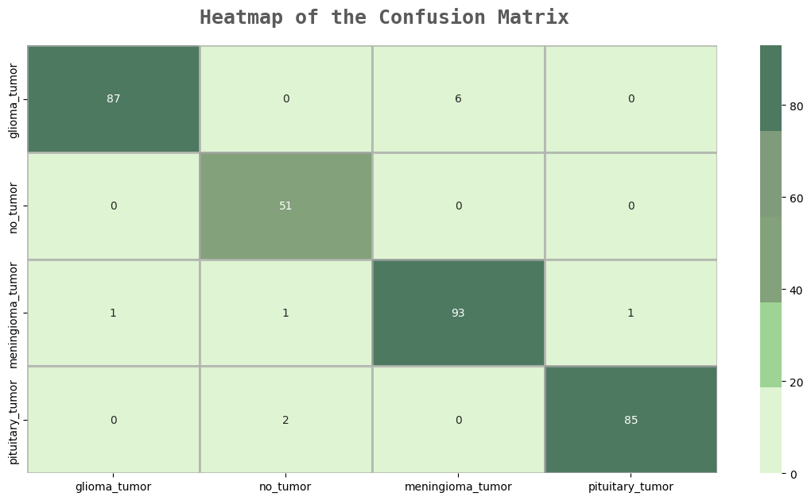

### Observations

- Training accuracy rises quickly and finishes near the top of the range, which suggests EfficientNetB0 learns the MRI feature space effectively.
- Validation accuracy tracks the training curve closely, which is a good sign that the model is not severely overfitting.
- Training and validation loss both decrease and stabilize, showing that optimization converges cleanly.
- The confusion matrix shows strong diagonal dominance, especially for `no_tumor` and `meningioma_tumor`.
- The main residual confusion appears between tumor classes that share similar visual structures, which is expected in slice-based MRI classification.

---

## 8. Performance Metrics

The notebook reports the following classification metrics on the held-out evaluation split of 327 images.

| Metric | Value | Interpretation |
| --- | ---: | --- |
| Accuracy | 0.97 | Overall proportion of correct predictions |
| Precision | 0.97 | How many predicted classes were correct |
| Recall | 0.97 | How many true cases were recovered |
| F1 Score | 0.97 | Harmonic balance between precision and recall |
| ROC-AUC | Not reported | Not computed in the current notebook |

**Final achieved accuracy:** **97%**

These values indicate that the model is performing well as a four-class classifier on the current evaluation split. For medical use, however, the model should still be validated on independent clinical data before any real-world deployment.

---

## 9. Explainability (Grad-CAM)

Status and recommended next step

No Grad-CAM visualizations are currently stored in the repository.

If you want to add explainability, the best place is **after the evaluation / confusion matrix block in [main.ipynb](main.ipynb)**. That section already has the trained model in memory, which makes it the ideal place to:

1. Select a test MRI image.
2. Generate the Grad-CAM heatmap.
3. Overlay the heatmap on the original image.
4. Save the result into `assets/gradcam-*.png`.

The visual sequence should be:

- Original MRI
- Grad-CAM heatmap
- Overlay
- Prediction

Explainability matters because it helps a human reviewer understand whether the model is focusing on a relevant tumor region or on irrelevant background artifacts. In medical AI, that is essential for trust, auditability, and safer research workflows.

---

## 10. Limitations

Practical constraints to keep in mind

- The dataset is moderate in size, so the model can still be sensitive to unseen imaging conditions.
- The class distribution is not perfectly balanced, especially for `no_tumor`.
- The notebook uses a slice-based classification approach, so it does not capture full 3D anatomy.
- The results should not be treated as clinical-grade evidence without external validation.
- MRI quality, scanner settings, and acquisition protocols can vary widely across institutions.
- The current repo is optimized for notebook experimentation rather than production deployment.

---

## 11. Future Work

Possible upgrades that would strengthen the project

- Vision Transformers for stronger global context modeling.
- Ensemble models to reduce class-specific prediction noise.
- Segmentation before classification to isolate tumor regions.
- Real-time inference for clinical-style review tools.
- FastAPI or Flask deployment for a lightweight web API.
- Docker containerization for reproducible environments.
- Cloud deployment for scalable inference.
- Mobile application support for edge-assisted screening.
- Clinical integration with PACS-style workflows and audit trails.

---

## 12. References

Core references and documentation

- EfficientNet paper: Tan, M. and Le, Q. V., *EfficientNet: Rethinking Model Scaling for Convolutional Neural Networks*.
- TensorFlow documentation: https://www.tensorflow.org/
- Keras documentation: https://keras.io/
- Grad-CAM paper: Selvaraju et al., *Grad-CAM: Visual Explanations from Deep Networks via Gradient-based Localization*.
- Repository dataset: local MRI images stored under `Training/` and `Testing/`.

---

## Repository Contents

| Path | Description |
| --- | --- |
| [main.ipynb](main.ipynb) | Notebook containing preprocessing, training, evaluation, and prediction |
| `effnet.h5` | Saved trained model checkpoint |
| `Training/` | Training images organized by class |
| `Testing/` | Testing images organized by class |
| `logs/` | TensorBoard logs |
| `assets/` | Exported notebook figures and representative sample images |

## Prediction Output

The helper function `img_pred()` returns one of the following labels:

- Glioma Tumor
- No Tumor
- Meningioma Tumor
- Pituitary Tumor

