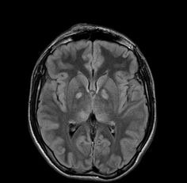
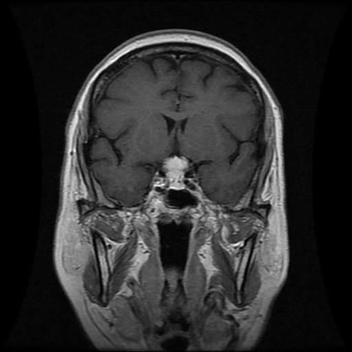

# Brain Tumor Classification

An end-to-end brain MRI classification project built around transfer learning with EfficientNetB0. The notebook trains a model that recognizes four MRI categories and saves the best checkpoint as `effnet.h5`.

## Project Overview

This repository focuses on classifying brain MRI images into four labels:

- glioma_tumor
- meningioma_tumor
- no_tumor
- pituitary_tumor

The workflow in `main.ipynb` loads the dataset, resizes images to 150 x 150, trains an EfficientNet-based classifier, evaluates it with a classification report and confusion matrix, and provides a helper for single-image prediction.

## Key Features

- Transfer learning with EfficientNetB0 for strong image feature extraction.
- Four-class MRI classification for common brain tumor categories.
- Training and validation tracking with TensorBoard.
- Best-model saving through `effnet.h5` checkpointing.
- Learning-rate reduction with `ReduceLROnPlateau`.
- Evaluation using accuracy, classification report, and confusion matrix.
- Simple prediction function for testing an individual MRI image.

## Dataset Structure

The dataset is split into separate `Training/` and `Testing/` folders, and each folder contains the same four classes above.

- Training images: 2,870
- Testing images: 394
- Total images: 3,264

### Sample Dataset Images

<table>
	<tr>
		<td align="center">
			<strong>Training sample</strong> 
			
		</td>
		<td align="center">
			<strong>Testing sample</strong> 
			
		</td>
	</tr>
</table>

## Notebook Workflow

1. Load MRI images from the training and testing directories.
2. Resize every image to 150 x 150 pixels.
3. Shuffle and split the data for training and validation.
4. Build an EfficientNetB0-based classifier with global average pooling and dropout.
5. Train the model for 12 epochs with checkpointing and learning-rate scheduling.
6. Evaluate the predictions using the test split.
7. Predict the class of a custom MRI image with the helper function.

## Repository Contents

- `main.ipynb` - notebook for data loading, training, evaluation, and inference.
- `effnet.h5` - saved trained model.
- `Training/` - labeled training data.
- `Testing/` - labeled testing data.
- `logs/` - TensorBoard logs created during training.

## Prediction Output

The notebook includes a helper that accepts an image path and returns one of the following predictions:

- Glioma Tumor
- No Tumor
- Meningioma Tumor
- Pituitary Tumor

## Notes

This project is notebook-driven and is intended for experimentation, model inspection, and quick inference on MRI images. For best results, keep the folder structure unchanged so the notebook can load the dataset correctly.
